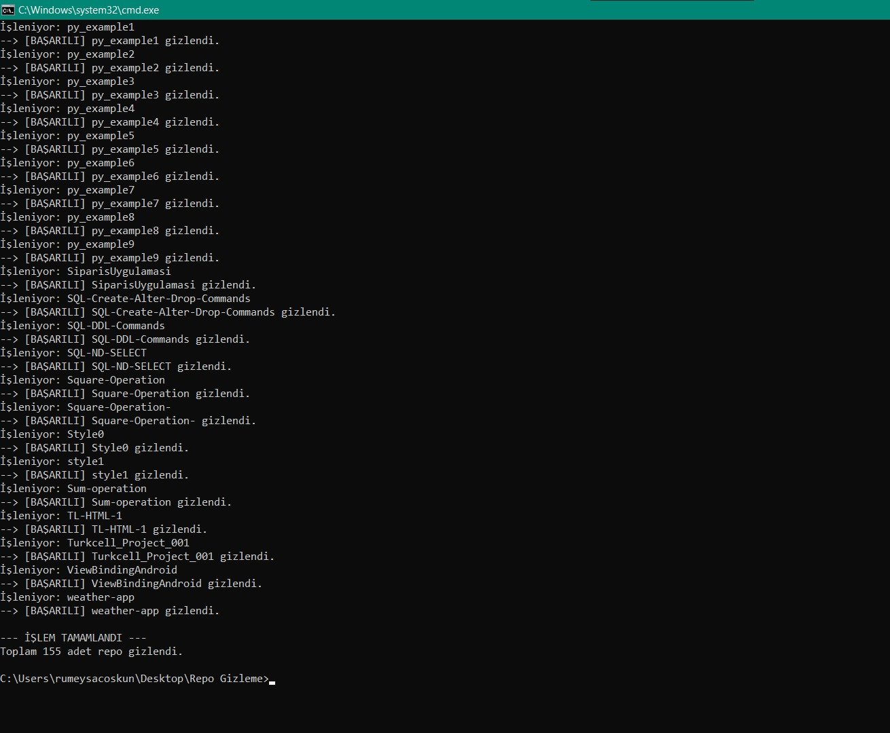

# github-cleaner-python
Clean public repo automated with python tool.

# 🧹 GitHub Repo Cleaner (Toplu Repo Gizleyici)

GitHub hesabınızda birikmiş, kullanılmayan veya eski "Public" repoları tek tek elle gizlemekle uğraşmayın! Bu Python scripti, belirlediğiniz kriterlere göre repolarınızı saniyeler içinde **Private (Gizli)** moda çeker.

---

## 📸 Ekran Görüntüsü (Demo)

Script çalıştırıldığında 155 adet repoyu saniyeler içinde temizlerken:



---

## 🚀 Özellikler

* **Otomatik Tespit:** Hesabınızdaki tüm repoları tarar.
* **Akıllı Filtreleme:** Zaten "Private" olan repoları atlar, sadece "Public" olanları işler.
* **Güvenli:** Silme işlemi yapmaz, sadece görünürlüğü değiştirir.
* **API Dostu:** GitHub API limitlerine takılmamak için bekleme süreleri içerir.

---

## 🛠️ Kurulum

1. Proje dosyalarını bilgisayarınıza indirin (veya bu repoyu klonlayın).
2. Gerekli kütüphaneyi kurun:

```bash
pip install PyGithub

Yapılandırma (Token Alma)
Bu scriptin çalışması için bir GitHub Personal Access Token'a ihtiyacınız var.

GitHub'da Settings > Developer settings > Personal access tokens > Tokens (classic) yolunu izleyin.

Generate new token diyerek yeni bir token oluşturun.

Select scopes bölümünden repo kutucuğunu işaretleyin (Bu yetki repoları yönetmek için şarttır).

Oluşturulan token'ı kopyalayın ve güvenli bir yerde saklayın.

Kullanım
Terminal veya Komut Satırını açın, projenin olduğu klasöre gelin ve scripti çalıştırın:

Bash

python repo_gizleme.py
⚠️ Yasal Uyarı
Bu araç GitHub API kullanır. Token bilgilerinizi asla kimseyle paylaşmayın ve kodun içine açıkça yazıp internete (public repolara) yüklemeyin. Token'ı güvenli bir şekilde (Input yöntemi veya Environment Variable ile) kullanmanız önerilir.
